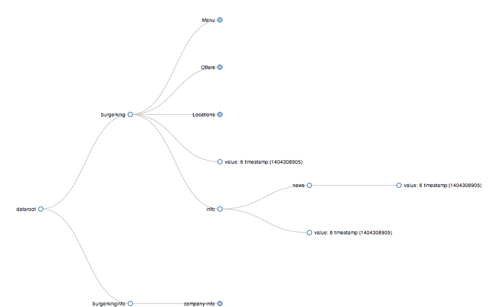
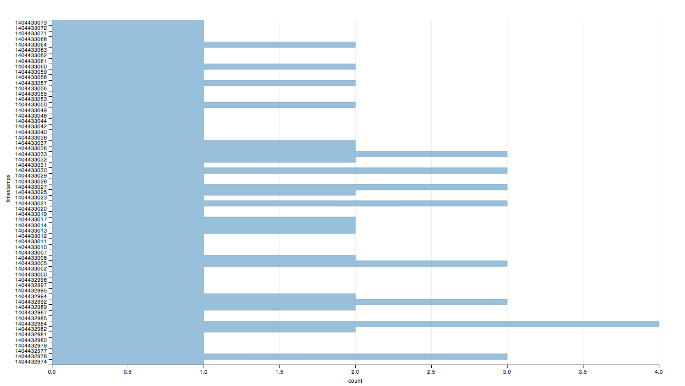
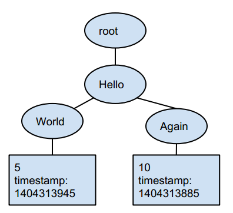
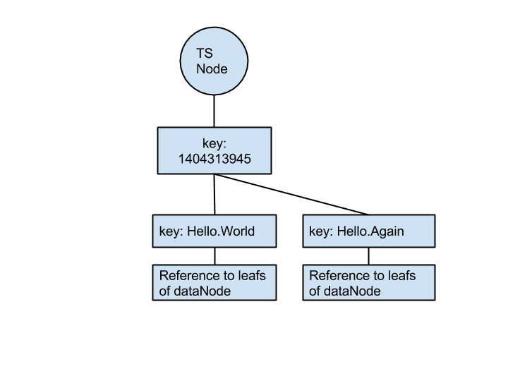

#TAS Documentation
TAS stands for True Air Speed, or you can call it Tree Avoidance System. It is a lightweight storage system that comes with a garbage collector. The garbage collector deletes expired nodes from the tree at a fixed interval.

TAS is useful if you have a lot of incoming traffic to your website and want to automatically delete the information that has been longer than 60 seconds.

#Commands
The incoming message to TAS server needs to be in the following format:
	INCR/APPEND TIMESTAMP KEY VALUE

- INCR: increments the value under the KEY with VALUE. 
- APPEND: appends the VALUE to an existing VALUE under KEY. 
- TIMESTAMP: the timestamp must be a string representation of an integer in UNIX format.-
- KEY: the path to where the tree is stored. Each level must be separated by a period. See section “Tree Structure” for more details.
- VALUE: VALUE must be integer when using INCR and a slice when using APPEND. It’s recommended that you encode VALUE using json when it’s a slice.

*Note:
If you create new data using APPEND with a key, the program will ignore any subsequent INCR command with the same key. This is because the key for APPEND is a slice, whereas the key for INCR is an int. The same applies to INCR. If you create new data using INCR with a key first, any subsequent APPEND request to the same key will be ignored.
*

#Options/Configurations
There are also handy web pages to help you with debugging. If you didn’t change the default http port, 7451, you can access the web pages by prepending http://localhost:7451/ to the title of the following subtitles. For example, http://localhost:7451/GET 

**GET**
It returns the tree in hash map format. 
You can also access an individual value. For example, say if you want to find the value under key = “cart.seafood.basket1”, enter http://localhost:7451/GET?key=cart.seafood.basket1 in your browser.
Wildcards are also accepted. For example, you can do http://localhost:7451/GET?key=cart.seafood.* or http://localhost:7451/GET?key=*.*.* 
If you know the value of the timestamp and just want the values of the nodes with the timestamp, you can add parameter “t”. For example, http://localhost:7451/GET?key=cart.seafood.basket1&t=1404148628.

*Note:
You will see null if you haven’t specified the key or the key doesn’t exist. 
Make sure that you have already inserted it in the tree.
The garbage collector deletes nodes in the tas server that have a timestamp 60 seconds older than the current time by default. You can make your timestamp far away in the future to prevent the garbage collector from deleting the data before you read it on the GET page.
*

When there are more than one timestamp with the same key, the returned value is calculated using (sum of all values with the same key)/[(the number of nodes) x interval\_second]. The interval\_second by default is 5 seconds. This is feature is useful if you want to see the average over an interval. You can change the interval\_second using parameter "i". For example, http://localhost:7451/GET?key=cart.seafood.basket1&i=2 will change interval\_second to 2 for the duration of the GET request.

*Note:
The i parameter only applies to data stored using INCR because they are int. The equation (sum of all values with the same key)/[(the number of nodes) x interval\_second] will not be applied to data stored using APPEND.
*

**DIAG**
It displays three values:
1. gc_running: Indicates whether the garbage collector is running.
2. num_leafs: The number of leafs in the tree.
3. oldest_timestamp: The oldest timestamp in the tree.
4. ts_counts: A map of timestamps and their corresponding value.

**TREE**
It returns you the tree representation of your data.

The leaf nodes store the value and its timestamp. All leaf nodes are represented with an unfilled circle. A node which can be expanded is represented by a filled circle. 
The key of the leaf node is stored in the branch from root to the leaf node. For example, in the graph above, there are two nodes with the same value of 6 and timestamp of 1404308905. However, their keys are different. One has key dataroot.burgerking. The other has dataroot.burgerking.info.news.

The tree visualization is created using [D3.js](http://d3js.org/) based on this [example](http://bl.ocks.org/mbostock/4339083).

**STATS**
The page shows the number of nodes for each timestamp in the tree.

The bar graph is generated using [dimple](http://dimplejs.org/) based on the [Horizontal Bar](http://dimplejs.org/examples_viewer.html?id=bars_horizontal) example.

#Tree Structure
TAS stores, organizes and deletes data using tree structure. A simple way of understanding TAS’s storage system is by imagining 2 different trees. One which represents the data itself with root *dataNode* and a smaller tree to make garbage collecting efficient with root *timestampNode*.

The tree with the root dataNode is used to structure the data. If a user inputs *INCR 1404313845 Hello.World 5* and *INCR 1404313885 Hello.Again 10*, the tree would be stored like the diagram below. Each level in key is separated by “.”

The tree with the root as timestampNode is designed for the sole purpose of garbage collection. The leaf nodes of timestampNode reference to the leaf nodes of dataNode. For the same input, the tree for garbage collector would be like this:

#Garbage Collector
The TAS Garbage Collector(GC) treats everything older than 60 seconds of the current time as expired data. At roughly every 5 seconds, the GC deletes data in the tree that is exactly 60 seconds older than the current time. For example, say the garbage collector runs at time 10000, only the nodes with timestamp at exactly 9940 will be deleted. The nodes with timestamp older than 9940 will be ignored. The GC will delete all the other expired nodes when the timestamp is divisible by 8. The GC does not traverse the tree and deletes expired nodes every time to eliminate the number of times of traversing a potentially very large tree.
